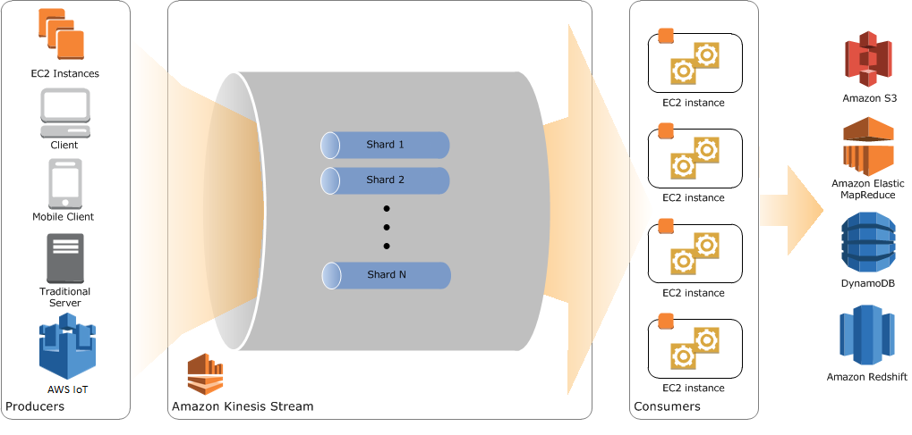

# Data Streaming #

* Data generated continuously by data sources
* Data streaming send in data simultaneously
* Data is processed sequentially and incrementally on a record-by-record basis
* Industry tools: AWS Kinesis, Apache Kafka, Apache Spark, and IronMQ
