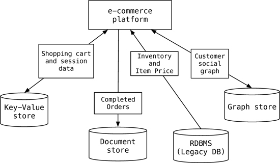

# Polyglot Persistence #

* Store data using multiple database technologies
* Database technology is chosen by individual applications or components of a single application
* Choice is based on the needs and requirements of the application
* Analogous to 'Polyglot Programming' - applications are using mixture of programming languages
