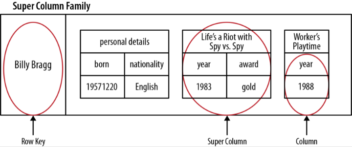

# Wide Column Databases #

* Column family is an object that contains columns of related data
* Column family is a "table" where each key-value pair being a "row"
* Each column is a complex type consisting of a column name, a value, and a timestamp
* There is also super column family - a map of super columns

	

