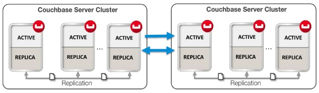

# XDCR - Cross Data Center Replication #

* Continuously replicates data using DCP data change protocol between clusters

	

* Version 1 uses the REST protocol for replication, important for ElasticSearch plug-in
* Version 2 uses memcached REST protocol, higher performance mode
* May require more cores and memory, firewall and Tls considerations are important